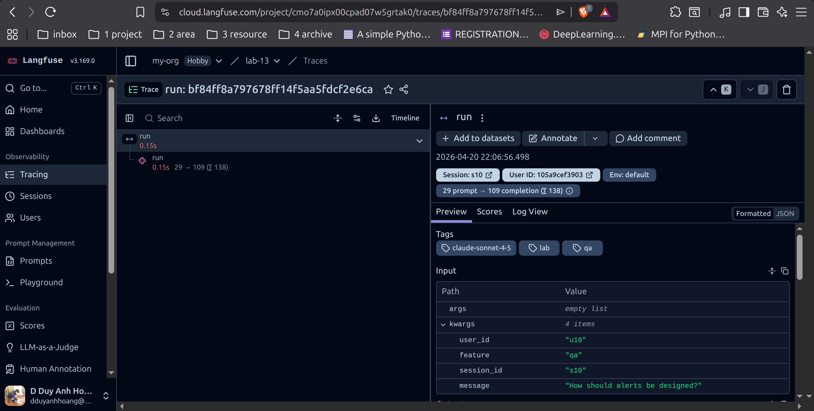

# Day 13 Observability Lab Report

> **Instruction**: Fill in all sections below. This report is designed to be parsed by an automated grading assistant.
> Ensure all tags (e.g., `[GROUP_NAME] `) are preserved.

## 1. Team Metadata

- [GROUP_NAME]  : Solo (E402 - Hoang Dinh Duy Anh, since I were absent today.)
- [REPO_URL]  : https://github.com/dduyanhhoang/Lab13-Observability
- [MEMBERS]  :
    - Member A: Hoang Dinh Duy Anh
---

## 2. Group Performance (Auto-Verified)

- [VALIDATE_LOGS_FINAL_SCORE]  : 100/100
- [TOTAL_TRACES_COUNT]  : 22+ (SPAN: 12, GENERATION: 10 confirmed in Langfuse UI)
- [PII_LEAKS_FOUND]  : 0

---

## 3. Technical Evidence (Group)

### 3.1 Logging & Tracing

- [EVIDENCE_CORRELATION_ID_SCREENSHOT] : 

```shell
(Lab13-Observability) al@asus:~/Resources/vin/Lab13-Observability$ tail -5 data/logs.jsonl | while IFS= read -r line; do echo "$line" | uv run python -m json.tool; echo "---"; done
{
    "service": "api",
    "latency_ms": 150,
    "tokens_in": 30,
    "tokens_out": 93,
    "cost_usd": 0.001485,
    "payload": {
        "answer_preview": "Starter answer. Teams should improve this output logic and add better quality ch..."
    },
    "event": "response_sent",
    "user_id_hash": "1632c29ecdec",
    "model": "claude-sonnet-4-5",
    "env": "dev",
    "session_id": "s07",
    "feature": "qa",
    "correlation_id": "req-e63a7521",
    "level": "info",
    "ts": "2026-04-20T14:56:15.608690Z"
}
---
{
    "service": "api",
    "payload": {
        "message_preview": "What is the policy for PII and credit card [REDACTED_CREDIT_CARD] ?"
    },
    "event": "request_received",
    "user_id_hash": "4d14d5d4f719",
    "model": "claude-sonnet-4-5",
    "env": "dev",
    "session_id": "s09",
    "feature": "qa",
    "correlation_id": "req-6ef91638",
    "level": "info",
    "ts": "2026-04-20T14:56:15.609846Z"
}
---
{
    "service": "api",
    "latency_ms": 150,
    "tokens_in": 37,
    "tokens_out": 103,
    "cost_usd": 0.001656,
    "payload": {
        "answer_preview": "Starter answer. Teams should improve this output logic and add better quality ch..."
    },
    "event": "response_sent",
    "user_id_hash": "4d14d5d4f719",
    "model": "claude-sonnet-4-5",
    "env": "dev",
    "session_id": "s09",
    "feature": "qa",
    "correlation_id": "req-6ef91638",
    "level": "info",
    "ts": "2026-04-20T14:56:15.761099Z"
}
---
{
    "service": "api",
    "payload": {
        "message_preview": "How should alerts be designed?"
    },
    "event": "request_received",
    "user_id_hash": "105a9cef3903",
    "model": "claude-sonnet-4-5",
    "env": "dev",
    "session_id": "s10",
    "feature": "qa",
    "correlation_id": "req-3c9eb150",
    "level": "info",
    "ts": "2026-04-20T14:56:15.762433Z"
}
---
{
    "service": "api",
    "latency_ms": 150,
    "tokens_in": 29,
    "tokens_out": 163,
    "cost_usd": 0.002532,
    "payload": {
        "answer_preview": "Starter answer. Teams should improve this output logic and add better quality ch..."
    },
    "event": "response_sent",
    "user_id_hash": "105a9cef3903",
    "model": "claude-sonnet-4-5",
    "env": "dev",
    "session_id": "s10",
    "feature": "qa",
    "correlation_id": "req-3c9eb150",
    "level": "info",
    "ts": "2026-04-20T14:56:15.913535Z"
}
---
```

- [EVIDENCE_PII_REDACTION_SCREENSHOT] :

```shell
(Lab13-Observability) al@asus:~/Resources/vin/Lab13-Observability$ uv run python tmp_show_pii.py                                                                                                                     
{
  "service": "api",
  "payload": {
    "message_preview": "Here is my phone [REDACTED_PHONE_VN] , what should be logged?"
  },
  "event": "request_received",
  "user_id_hash": "64f6ec689229",
  "model": "claude-sonnet-4-5",
  "env": "dev",
  "session_id": "s05",
  "feature": "qa",
  "correlation_id": "req-2a6ee6d7",
  "level": "info",
  "ts": "2026-04-20T14:56:14.391735Z"
}
```

- [EVIDENCE_TRACE_WATERFALL_SCREENSHOT] : 



- [TRACE_WATERFALL_EXPLANATION] : Each `run` trace in Langfuse has two child spans: a RAG span (~150ms normal, ~2500ms
  when rag_slow is injected) and an LLM generation span (~150ms). The RAG span duration is the key signal for latency
  root cause — if it is wide, the bottleneck is retrieval, not the model.

### 3.2 Dashboard & SLOs

- [DASHBOARD_6_PANELS_SCREENSHOT] : 

![img.png] (img.png)

- [SLO_TABLE] :

| SLI         |      Target | Window |                            Current Value |
|-------------|------------:|--------|-----------------------------------------:|
| Latency P95 |    < 3000ms | 28d    | 150ms (normal) / 2650ms (under rag_slow) |
| Error Rate  |        < 2% | 28d    |     0% (normal) / 100% (under tool_fail) |
| Cost Budget | < \$2.5/day | 1d     |                 ~\$0.02 per 10-req batch |

### 3.3 Alerts & Runbook

- [ALERT_RULES_SCREENSHOT] : 
```yaml
alerts:
  - name: high_latency_p95
    severity: P2
    condition: latency_p95_ms > 5000 for 30m
    type: symptom-based
    owner: team-oncall
    runbook: docs/alerts.md#1-high-latency-p95
  - name: high_error_rate
    severity: P1
    condition: error_rate_pct > 5 for 5m
    type: symptom-based
    owner: team-oncall
    runbook: docs/alerts.md#2-high-error-rate
  - name: cost_budget_spike
    severity: P2
    condition: hourly_cost_usd > 2x_baseline for 15m
    type: symptom-based
    owner: finops-owner
    runbook: docs/alerts.md#3-cost-budget-spike
```
- [SAMPLE_RUNBOOK_LINK] : docs/alerts.md

---

## 4. Incident Response (Group)

### Incident: rag_slow

- [SCENARIO_NAME] : rag_slow
- [SYMPTOMS_OBSERVED] : P95 latency jumped from 150ms to ~13000ms per request. No errors. Alert `high_latency_p95` would
  fire (P95 > 5000ms threshold).
- [ROOT_CAUSE_PROVED_BY] : Langfuse trace — `run` span shows RAG child span consuming ~2500ms while LLM span remains ~
  150ms. RAG is the exclusive bottleneck.
- [FIX_ACTION] : Add timeout on RAG call (e.g. 1s). On timeout, fall back to LLM-only path with empty context.
- [PREVENTIVE_MEASURE] : Circuit breaker on RAG dependency. Cache frequent queries. Monitor RAG span P95 separately from
  LLM span P95 in dashboard.

### Incident: tool_fail

- [SCENARIO_NAME] : tool_fail
- [SYMPTOMS_OBSERVED] : 100% of requests returned HTTP 500. `error_breakdown: {"RuntimeError": 10}` in /metrics. Alert
  `high_error_rate` fires (P1).
- [ROOT_CAUSE_PROVED_BY] : Log lines with `"event": "request_failed", "error_type": "RuntimeError"` — all sharing the
  same call stack. Correlation IDs confirm every request fails at the RAG step.
- [FIX_ACTION] : Wrap RAG call in try/except RuntimeError; return empty docs and continue with LLM-only answer rather
  than propagating the error.
- [PREVENTIVE_MEASURE] : RAG health-check endpoint. Alert on consecutive failures before error rate hits SLO threshold.

### Incident: cost_spike

- [SCENARIO_NAME] : cost_spike
- [SYMPTOMS_OBSERVED] : No errors, normal latency, but `avg_cost_usd` doubled (0.0021 → 0.0041) and `tokens_out_total`
  tripled (2642 → 7974) in /metrics. Alert `cost_budget_spike` fires.
- [ROOT_CAUSE_PROVED_BY] : `tokens_out_total` spiked while `tokens_in_total` stayed flat — output token explosion without
  input change. Affected both `qa` and `summary` features equally, ruling out a bad prompt. Points to LLM config (
  missing max_tokens cap).
- [FIX_ACTION] : Add `max_tokens` hard cap on every LLM call.
- [PREVENTIVE_MEASURE] : Monitor `tokens_out / tokens_in` ratio as derived metric. Per-request cost alert if
  `cost_usd > 2× baseline`. This is a silent failure — only visible via cost/token metrics, not error rate.

---

## 5. Individual Contributions & Evidence

Hoang Dinh Duy Anh

- [TASKS_COMPLETED] :
    - Task 1: Implemented CorrelationIdMiddleware (`app/middleware.py`) — `clear_contextvars`, generate `req-<8hex>`,
      `bind_contextvars`, response headers
    - Task 2: Log context enrichment in `/chat` handler (`app/main.py`) — `bind_contextvars` with `user_id_hash`,
      `session_id`, `feature`, `model`, `env`
    - Task 3: Enabled PII scrubbing processor in structlog pipeline (`app/logging_config.py`)
    - Task 4: Extended PII patterns (`app/pii.py`) — added `passport_vn`, `tax_id_vn`, `address_keyword`
    - Task 5: Validated logs — 100/100 score, 0 PII leaks, 10 unique correlation IDs
    - Task 6: Fixed Langfuse v3 integration — `load_dotenv()` in `app/main.py`, corrected import paths (
      `from langfuse import observe, get_client`), mapped `update_current_observation` to `update_current_generation`
    - Task 7: Built 6-panel HTML dashboard (`dashboard.html`) — live polling, Chart.js, colour-coded SLO alerts
    - Task 8: Injected all 3 incidents, documented root cause analysis with metrics evidence
- [EVIDENCE_LINK] : All of them.

---

## 6. Bonus Items (Optional)

- [BONUS_COST_OPTIMIZATION] : Identified cost_spike incident silently doubles cost with no error signal — recommended
  `max_tokens` cap and `tokens_out/tokens_in` ratio metric
- [BONUS_AUDIT_LOGS] : (not implemented)
- [BONUS_CUSTOM_METRIC] : `tokens_out / tokens_in` ratio as a derived anomaly signal for LLM cost spikes
